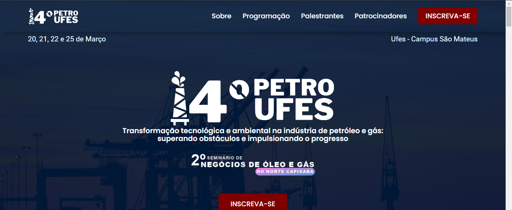

# Petroufes

## Descrição
Site desenvolvido para o 14° Petroufes, um evento realizado pelo Capítulo Estudantil SPE Ufes, que busca integrar a comunidade acadêmica e profissional da indústria de petróleo. Este foi meu primeiro projeto profissional, e sei que tem muito a melhorar

## Demonstração
Confira o vídeo de apresentação do site:

## Funcionalidades
- Link para incrição.
- Descrição do evento.
- Programação detalhada.
- Informações sobre palestrantes e link para LinkedIn.
- Patrocinadores do evento e link para os sites.
- Realização do evento.
- Seção de dúvidas com botão para pergunta.
- Informações de contato.

## Tecnologias Utilizadas
- HTML5
- CSS3
- JavaScript

## Como Acessar
Você pode acessar o site através do seguinte link: [petroufes.com](https://petroufes.com/)